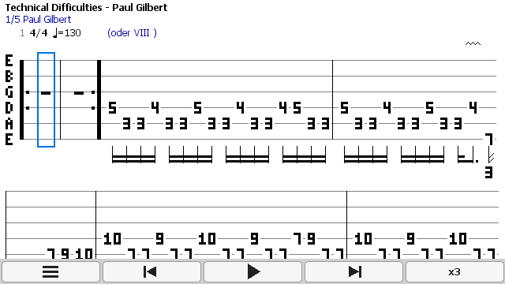

# GTab

Guitar Pro tab viewer for J2ME phones (Nokia S40, S60 and other MIDP 2.0 devices).

**Features:** opens GP3/GP4/GP5, MIDI playback with cursor, chord library, tuner, online tab search and GPX (Guitar Pro 6–8) conversion through the server in `gtabsrv/`. Keypad and touch screens, English and Russian UI.



## Build

Requirements: JDK 8, ProGuard 7.x, WTK API jars (`cldcapi11.jar`, `midpapi20.jar`, `jsr75.jar`, `mmapi.jar`).

```bash
JAVAC=/path/jdk8/bin/javac WTK=/path/wtk/lib PROGUARD=/path/proguard.jar ./build.sh
```

or with Ant (paths in `build.properties`, see `build.properties.example`):

```bash
ant
```

Result: `out/gtab.jar` and `out/gtab.jad`.

## Server

See `gtabsrv/README.md`. The server address is set in the app: Menu → Settings.

## License

Guitar Pro format readers are based on [TuxGuitar](https://github.com/helge17/tuxguitar) (LGPL-2.1).

---

# GTab (RU)

Просмотр табулатур Guitar Pro на J2ME-телефонах (Nokia S40, S60 и другие с MIDP 2.0).

**Возможности:** открывает GP3/GP4/GP5, воспроизведение MIDI с курсором, база аккордов, тюнер, поиск табов в сети и конвертация GPX (Guitar Pro 6–8) через сервер из папки `gtabsrv/`. Кнопочные и сенсорные экраны, интерфейс на русском и английском.


## Сборка

Нужны: JDK 8, ProGuard 7.x, jar-файлы API из WTK (`cldcapi11.jar`, `midpapi20.jar`, `jsr75.jar`, `mmapi.jar`).

```bash
JAVAC=/путь/jdk8/bin/javac WTK=/путь/wtk/lib PROGUARD=/путь/proguard.jar ./build.sh
```

или через Ant (пути в `build.properties`, образец — `build.properties.example`):

```bash
ant
```

Результат: `out/gtab.jar` и `out/gtab.jad`.

## Сервер

См. `gtabsrv/README.md`. Адрес сервера задаётся в приложении: Меню → Настройки.

## Лицензия

Чтение форматов Guitar Pro основано на [TuxGuitar](https://github.com/helge17/tuxguitar) (LGPL-2.1).